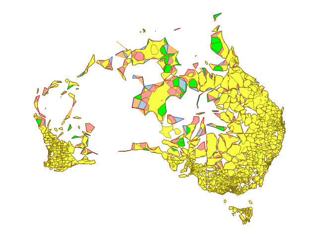
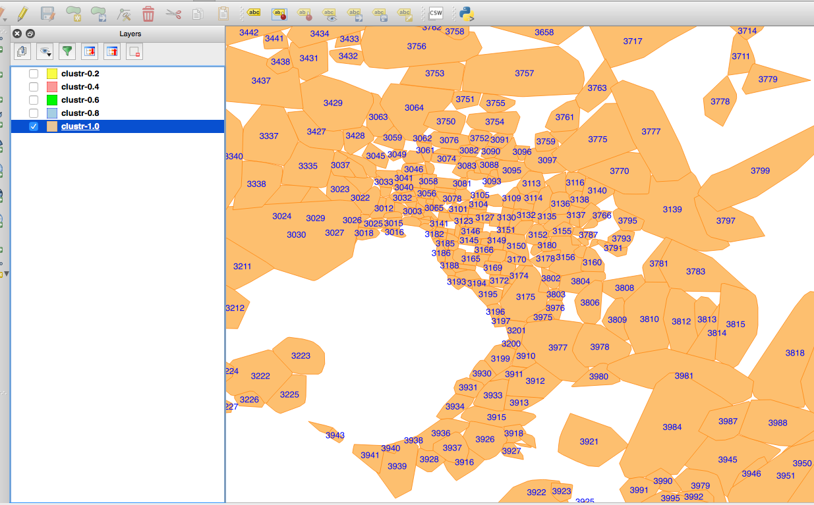

# whosonfirst-data-postalcode-au

Postal codes for Australia.

## About the data

This dataset is incomplete and approximate.

Specifically of the [3,330 records](data) included in this repository 892 of them lack any geographic data. They are ["visiting" Null Island](https://whosonfirst.mapzen.com/spelunker/nullisland/?iso=au) so to speak.

The [remaining 2,438 records](https://whosonfirst.mapzen.com/spelunker/placetypes/postalcode/?iso=au&exclude=nullisland) have geometries that were derived from the available address data for Australia [as provided by OpenAddresses](http://s3.amazonaws.com/data.openaddresses.io/runs/98975/au/countrywide.zip) on July 23, 2016 which was used to generate polygons using the [Clustr](https://github.com/whosonfirst/Clustr) tool.

All geometries generated using the Clustr tool should be considered approximate as denoted by the `mz:is_approximate` and `mz:is_clustr` properties. In time we expect (hope) that these records will be updated with current and authoritative data provided by the Australian postal service.

Until then these geometries are [at least more accurate](https://whosonfirst.mapzen.com/spelunker/id/504778857/) than "all of Australia" and have been assigned [full hierarchies](https://whosonfirst.mapzen.com/spelunker/id/85681497/descendants/?exclude=nullisland&placetype=postalcode) in Who's On First land.

## See also

* https://github.com/whosonfirst-data/whosonfirst-data-postalcode
* https://openaddresses.io/
* https://github.com/whosonfirst/Clustr